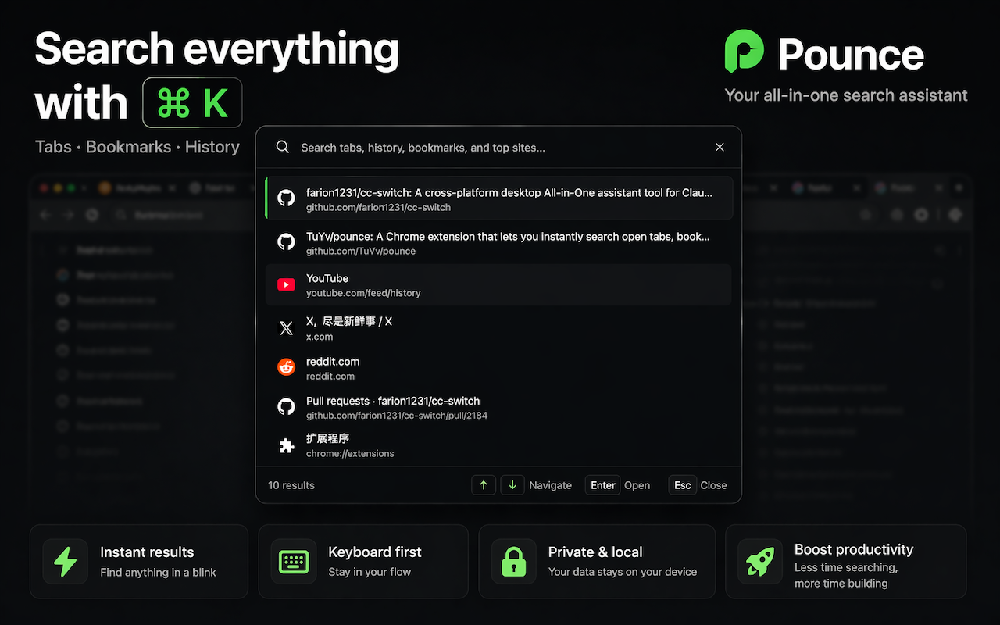
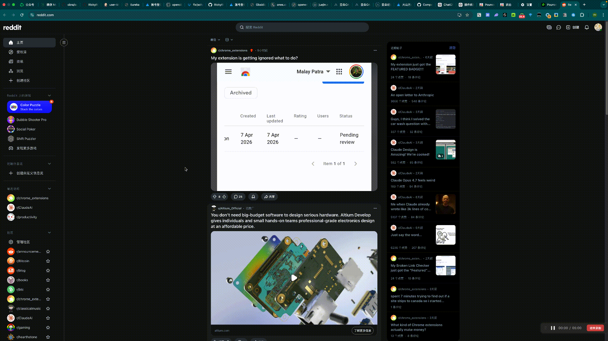

# Pounce

🌐 **English** · [中文](README.zh-CN.md)

### One keystroke to find anything in your browser.

Press `⌘K` to open a unified search overlay across your open tabs, bookmarks, history, and top sites. 
Keyboard-first, doesn't leave your current page.

**[→ Install from Chrome Web Store](https://chromewebstore.google.com/detail/clgpmlhecjlekgipngaopglbfdkonjdf)**

> The name *Pounce* — to leap and seize. 🐾
>
> When you need it, it pounces in and finds what you really want.

## Features

- 🔍 **Unified search** — one `⌘K`, search open tabs + bookmarks + history + top sites at once
- ⌨️ **Keyboard-first navigation** — arrows to move, Enter to jump, Esc to close; no mouse needed
- 🎨 **Built-in dark mode** — Light / Dark / System, switchable from the popup or settings
- 📚 **Batch open URLs** *(bonus)* — save a list of URLs, press `⌘⇧U` to open them all

## Keyboard Shortcuts

| Action | Mac | Windows / Linux |
|--------|-----|-----------------|
| Open search overlay | `⌘K` | `Alt+K` |
| Batch open saved URLs | `⌘⇧U` | `Ctrl+Shift+U` |
| Duplicate current tab | `⌘E` | `Ctrl+Shift+E` |
| Navigate results | `↑` / `↓` | `↑` / `↓` |
| Open selected result | `Enter` | `Enter` |
| Quick-pick result 1–9 | `⌥1`–`⌥9` | `Alt+1`–`Alt+9` |
| Close overlay | `Esc` | `Esc` |

> The overlay cannot be injected into `chrome://`, `chrome-extension://`, or `about:` pages. This is a Chrome-wide security restriction that applies to every extension.

## Permissions

All permissions are used only for core search functionality. **No data ever leaves your browser.**

| Permission | Purpose |
|------------|---------|
| `tabs` | Read open tab titles and URLs |
| `bookmarks` | Search bookmark titles and URLs |
| `history` | Include browser history in results |
| `topSites` | Include frequently visited sites |
| `storage` | Save your URL list and theme preference |
| `scripting` | Inject the search overlay into the current page |
| `activeTab` | Access the current tab when you trigger the overlay |

## Community

Pounce is conservatively maintained to stay fast, private, and focused. Bug fixes and well-scoped improvements are welcome. Use [Issues](https://github.com/TuYv/pounce/issues) for reproducible problems or concrete proposals, and [Discussions](https://github.com/TuYv/pounce/discussions) for early design questions.

## Contributing

See [CONTRIBUTING.md](CONTRIBUTING.md) for local setup, tests, project conventions, and pull request expectations. Good places to start include issues labeled [`good first issue`](https://github.com/TuYv/pounce/labels/good%20first%20issue) and [`help wanted`](https://github.com/TuYv/pounce/labels/help%20wanted).

## Roadmap

Current improvement areas include accessibility, automated test coverage, localization quality, and compatibility across Chromium-based browsers. These are direction areas rather than promised release dates.

## Security

Please report vulnerabilities privately by following [SECURITY.md](SECURITY.md). Do not disclose security issues in public Issues or Discussions.

## License

MIT — see [LICENSE](LICENSE)

## Changelog

See [CHANGELOG.md](CHANGELOG.md) for the full release history.
